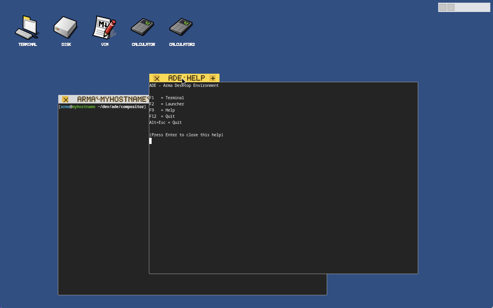

# ADE — Arma Desktop Environment

ADE is a lightweight Wayland window manager inspired by the clarity and usability of **BeOS** and **Haiku**.

Rather than chasing visual trends, ADE focuses on **clean interaction**, **fast workflows**, and **predictable behavior**. It is designed as a foundation for building productive, distraction-free work environments on Linux — where windows, input, and system UI behave consistently and transparently.

ADE is built on **wlroots** and targets modern Linux systems, while intentionally revisiting ideas that made earlier desktop systems feel coherent, responsive, and user-centric.

